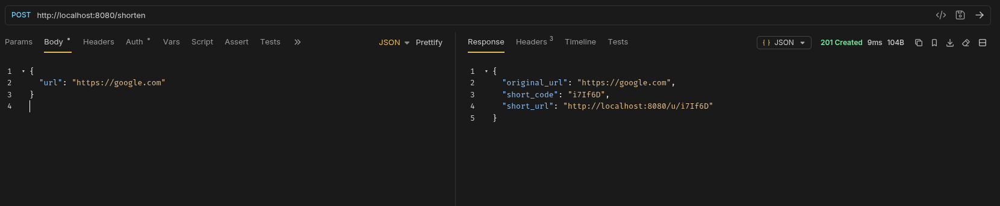
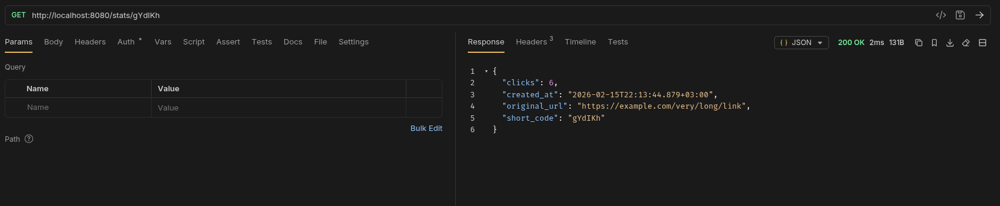

# URL Shortener – Go + Gin URL API

A lightweight and efficient REST API built with **Go 1.25**, **Gin**, and **MySQL**.  
Designed to help users shorten URLs, redirect them, and track basic statistics with a clean and simple structure.

---

## 🔧 Features

- Shorten long URLs into short codes
- Redirect users to the original URL
- Track number of clicks per short link
- MySQL-backed persistent storage
- Clean project architecture using internal packages
- Fast and minimal API powered by Gin
- Dockerized for easy setup and deployment

---

## 🛠 Tech Stack

- **Go 1.25**
- **Gin Web Framework**
- **MySQL**
- **GORM**
- **Docker & Docker Compose**

---

## 🚀 Usage

1. Clone the repository:

   ```
   git clone https://github.com/mnzeiter/url-shortener.git
   ```

2. Start services using Docker:

   ```
   docker-compose up --build
   ```

3. Your API is now live at:

   ```
   http://localhost:8080
   ```

---

## 🧪 Endpoints

### ➕ Shorten URL  
**POST** `/shorten`

```
{
  "url": "https://example.com/very/long/link"
}
```

---

### 🔗 Redirect  
**GET** `/u/<code>`

Redirects to the original URL.

---

### 📊 URL Stats  
**GET** `/stats/<code>`

---

## 📷 API Test Screenshot




---

## 🌐 Connect with Me
- 💼 [LinkedIn](https://linkedin.com/in/mozeiter)  
- 🌍 [Portfolio Website](https://mohammadalzeiter.com)  
- 📧 Email: mohammadalzeiter@outlook.com

---

## ✨ A clean and modern URL Shortener API built with Go, Gin, and MySQL.

